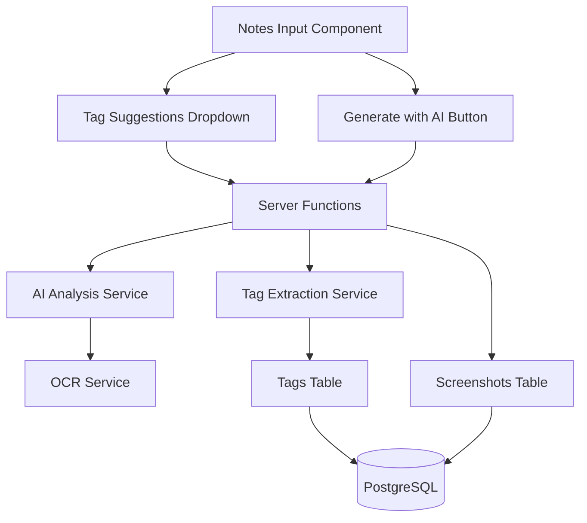

# Design Document: Enhanced Notes with Tags and AI

## Overview

This feature extends the Receipts Tracker's notes functionality with two major enhancements: hashtag-based tagging and optional AI-powered note generation. The tagging system provides a lightweight, user-friendly way to organize screenshots using hashtags (e.g., #project-alpha, #meeting-notes) with autocomplete suggestions based on previously used tags. The AI note generation feature leverages OCR and image analysis to automatically create descriptive notes, but only when explicitly requested by the user to maintain cost control.

The implementation follows the existing architecture patterns using TanStack Start server functions, PostgreSQL for storage, and React components for the UI. Special attention is given to performance (tag suggestions must be instant), user experience (clear hints and feedback), and cost management (AI generation is opt-in only).

## Architecture

### High-Level Architecture



### Technology Stack

- **Frontend**: React 19, TanStack Router, Tailwind CSS
- **Backend**: TanStack Start Server Functions
- **Database**: PostgreSQL with Drizzle ORM (schema only)
- **AI Service**: OpenAI GPT-4 Vision or Claude 3 (configurable)
- **OCR**: Tesseract.js or cloud OCR service
- **Tag Parsing**: Custom regex-based parser

## Components and Interfaces

### Frontend Components

#### 1. EnhancedNotesInput Component
**Purpose**: Notes input field with hashtag highlighting and autocomplete

**Props**:
```typescript
interface EnhancedNotesInputProps {
  value: string
  onChange: (value: string) => void
  userId: number
  placeholder?: string
  className?: string
}
```

**State**:
```typescript
interface EnhancedNotesInputState {
  showSuggestions: boolean
  suggestions: TagSuggestion[]
  selectedSuggestionIndex: number
  cursorPosition: number
  currentHashtag: string | null
}
```

**Responsibilities**:
- Detect # character and show tag suggestions
- Highlight hashtags in real-time as user types
- Handle keyboard navigation (Arrow keys, Tab, Enter, Escape)
- Insert selected tag at cursor position
- Fetch tag suggestions from server

**Implementation Notes**:
- Use `contentEditable` div for rich text highlighting
- Debounce tag suggestion queries (100ms)
- Position dropdown relative to cursor position
- Support both mouse and keyboard selection

#### 2. TagSuggestionsDropdown Component
**Purpose**: Display autocomplete suggestions for hashtags

**Props**:
```typescript
interface TagSuggestionsDropdownProps {
  suggestions: TagSuggestion[]
  selectedIndex: number
  onSelect: (tag: string) => void
  onClose: () => void
  position: { top: number; left: number }
}

interface TagSuggestion {
  tag: string
  usageCount: number
  lastUsed: Date
}
```

**Responsibilities**:
- Display list of matching tags
- Show usage count for each tag
- Highlight selected suggestion
- Handle click and keyboard selection
- Close on outside click or Escape

#### 3. AIGenerateButton Component
**Purpose**: Trigger AI note generation with loading state

**Props**:
```typescript
interface AIGenerateButtonProps {
  screenshotId: number
  currentNotes: string
  onGenerated: (notes: string) => void
  onError: (error: string) => void
}
```

**State**:
```typescript
interface AIGenerateButtonState {
  isGenerating: boolean
  showConfirmOverwrite: boolean
}
```

**Responsibilities**:
- Display "Generate with AI" button
- Show loading spinner during generation
- Confirm before overwriting existing notes
- Handle errors with retry option
- Display token usage estimate (optional)

#### 4. TagHintBanner Component
**Purpose**: Show helpful hint about using hashtags

**Props**:
```typescript
interface TagHintBannerProps {
  userId: number
  onDismiss: () => void
}
```

**Responsibilities**:
- Display hint message with example
- Check if user has used tags before
- Allow dismissal and remember preference
- Show/hide based on user experience level

#### 5. TagList Component
**Purpose**: Display all user's tags with statistics

**Props**:
```typescript
interface TagListProps {
  userId: number
  onTagClick: (tag: string) => void
}
```

**Responsibilities**:
- Fetch and display all user tags
- Show usage count and date range
- Sort by usage or alphabetically
- Mark inactive tags
- Trigger search on tag click

### Server Functions

#### 1. getTagSuggestions
```typescript
const getTagSuggestions = createServerFn({ method: 'GET' })
  .validator((params: GetTagSuggestionsInput) => params)
  .handler(async ({ data }) => {
    // Validate user authentication
    // Query tags table for user's tags
    // Filter by partial match if query provided
    // Sort by lastUsed DESC
    // Return top 10 suggestions with usage count
  })

interface GetTagSuggestionsInput {
  userId: number
  query?: string // Partial tag to filter
}

interface TagSuggestion {
  tag: string
  usageCount: number
  lastUsed: Date
}
```

#### 2. extractAndStoreTags
```typescript
const extractAndStoreTags = createServerFn({ method: 'POST' })
  .validator((data: ExtractTagsInput) => data)
  .handler(async ({ data }) => {
    // Extract hashtags from notes text using regex
    // Normalize tags (lowercase, trim)
    // For each tag:
    //   - Check if exists in tags table for user
    //   - If exists, update lastUsed timestamp
    //   - If not, insert new tag record
    // Return extracted tags
  })

interface ExtractTagsInput {
  userId: number
  screenshotId: number
  notes: string
}
```

#### 3. generateNotesWithAI
```typescript
const generateNotesWithAI = createServerFn({ method: 'POST' })
  .validator((data: GenerateNotesInput) => data)
  .handler(async ({ data }) => {
    // Validate user authentication and ownership
    // Retrieve screenshot from database
    // Extract text using OCR service
    // Get user's existing tags for context
    // Build AI prompt with image, OCR text, and tag context
    // Call AI service (OpenAI or Claude)
    // Parse AI response
    // Extract hashtags from generated notes
    // Store tags in tags table
    // Return generated notes
  })

interface GenerateNotesInput {
  userId: number
  screenshotId: number
}

interface GenerateNotesOutput {
  notes: string
  extractedTags: string[]
  tokensUsed: number
}
```

#### 4. searchByTags
```typescript
const searchByTags = createServerFn({ method: 'GET' })
  .validator((params: SearchByTagsInput) => params)
  .handler(async ({ data }) => {
    // Validate user authentication
    // Parse hashtags from search query
    // Build SQL query with OR conditions for each tag
    // Use ILIKE for case-insensitive matching
    // Return matching screenshots with notes
  })

interface SearchByTagsInput {
  userId: number
  tags: string[] // Array of hashtags to search
}
```

#### 5. getUserTags
```typescript
const getUserTags = createServerFn({ method: 'GET' })
  .validator((params: GetUserTagsInput) => params)
  .handler(async ({ data }) => {
    // Validate user authentication
    // Query tags table for all user's tags
    // Join with screenshots to get usage count
    // Calculate date range for each tag
    // Mark tags not used in 30 days as inactive
    // Sort by usage count DESC
    // Return tag statistics
  })

interface GetUserTagsInput {
  userId: number
  sortBy?: 'usage' | 'alphabetical' | 'recent'
}

interface TagStatistics {
  tag: string
  usageCount: number
  firstUsed: Date
  lastUsed: Date
  isInactive: boolean
}
```

#### 6. migrateExistingTags
```typescript
const migrateExistingTags = createServerFn({ method: 'POST' })
  .validator((data: MigrateTagsInput) => data)
  .handler(async ({ data }) => {
    // Admin-only function (check permissions)
    // Query all screenshots with notes
    // For each screenshot:
    //   - Extract hashtags from notes
    //   - Store in tags table
    // Track success/failure counts
    // Return migration statistics
  })

interface MigrateTagsInput {
  adminKey: string // Security check
}

interface MigrationResult {
  screenshotsProcessed: number
  tagsExtracted: number
  errors: number
}
```

## Data Models

### Database Schema

```typescript
// src/db/schema.ts

// New table for tag storage
export const tags = pgTable('tags', {
  id: serial('id').primaryKey(),
  userId: integer('user_id').notNull().references(() => users.id, { onDelete: 'cascade' }),
  tag: text('tag').notNull(), // Normalized (lowercase)
  firstUsed: timestamp('first_used').defaultNow().notNull(),
  lastUsed: timestamp('last_used').defaultNow().notNull(),
  usageCount: integer('usage_count').default(1).notNull(),
  createdAt: timestamp('created_at').defaultNow().notNull(),
}, (table) => ({
  // Composite unique constraint: one tag per user
  userTagUnique: unique().on(table.userId, table.tag),
  // Indexes for performance
  userIdIdx: index('tags_user_id_idx').on(table.userId),
  tagIdx: index('tags_tag_idx').on(table.tag),
  lastUsedIdx: index('tags_last_used_idx').on(table.lastUsed),
}))

// New table for AI generation tracking (optional, for monitoring)
export const aiGenerations = pgTable('ai_generations', {
  id: serial('id').primaryKey(),
  userId: integer('user_id').notNull().references(() => users.id, { onDelete: 'cascade' }),
  screenshotId: integer('screenshot_id').notNull().references(() => screenshots.id, { onDelete: 'cascade' }),
  model: text('model').notNull(), // e.g., "gpt-4-vision", "claude-3-opus"
  tokensUsed: integer('tokens_used').notNull(),
  success: boolean('success').notNull(),
  errorMessage: text('error_message'),
  generatedAt: timestamp('generated_at').defaultNow().notNull(),
}, (table) => ({
  userIdIdx: index('ai_generations_user_id_idx').on(table.userId),
  screenshotIdIdx: index('ai_generations_screenshot_id_idx').on(table.screenshotId),
}))

// Update existing screenshots table (no schema changes needed)
// Notes field already exists and will contain hashtags
```

### TypeScript Types

```typescript
// src/types/tags.ts

export interface Tag {
  id: number
  userId: number
  tag: string
  firstUsed: Date
  lastUsed: Date
  usageCount: number
  createdAt: Date
}

export interface TagSuggestion {
  tag: string
  usageCount: number
  lastUsed: Date
}

export interface TagStatistics {
  tag: string
  usageCount: number
  firstUsed: Date
  lastUsed: Date
  isInactive: boolean
  screenshotIds: number[]
}

export interface AIGenerationResult {
  notes: string
  extractedTags: string[]
  tokensUsed: number
  model: string
}

export interface AIGenerationRecord {
  id: number
  userId: number
  screenshotId: number
  model: string
  tokensUsed: number
  success: boolean
  errorMessage: string | null
  generatedAt: Date
}
```

### Utility Functions

```typescript
// src/utils/tags.ts

export function extractHashtags(text: string): string[] {
  // Regex to match hashtags: #word, #word-word, #word_word
  // Must start with # followed by alphanumeric, hyphen, or underscore
  // Must end with space, punctuation, or end of string
  const hashtagRegex = /#([a-zA-Z0-9_-]+)(?=\s|[.,!?;:]|$)/g
  const matches = text.matchAll(hashtagRegex)
  const tags = Array.from(matches, m => m[1].toLowerCase())
  return [...new Set(tags)] // Remove duplicates
}

export function normalizeTag(tag: string): string {
  // Remove # if present
  // Convert to lowercase
  // Trim whitespace
  return tag.replace(/^#/, '').toLowerCase().trim()
}

export function formatTag(tag: string): string {
  // Ensure tag starts with #
  return tag.startsWith('#') ? tag : `#${tag}`
}

export function highlightHashtags(text: string): React.ReactNode {
  // Split text by hashtags
  // Return array of text and styled hashtag spans
  const parts: React.ReactNode[] = []
  const hashtagRegex = /(#[a-zA-Z0-9_-]+)/g
  let lastIndex = 0
  
  for (const match of text.matchAll(hashtagRegex)) {
    // Add text before hashtag
    if (match.index! > lastIndex) {
      parts.push(text.slice(lastIndex, match.index))
    }
    // Add styled hashtag
    parts.push(
      <span key={match.index} className="text-blue-400 font-semibold">
        {match[0]}
      </span>
    )
    lastIndex = match.index! + match[0].length
  }
  
  // Add remaining text
  if (lastIndex < text.length) {
    parts.push(text.slice(lastIndex))
  }
  
  return parts
}

export function isValidHashtag(tag: string): boolean {
  // Check if tag matches valid format
  const validHashtagRegex = /^#[a-zA-Z0-9_-]+$/
  return validHashtagRegex.test(tag)
}
```

```typescript
// src/utils/ai.ts

export interface AIConfig {
  provider: 'openai' | 'claude'
  apiKey: string
  model: string
  maxTokens: number
}

export function getAIConfig(): AIConfig | null {
  // Read from environment variables
  const provider = process.env.AI_PROVIDER as 'openai' | 'claude'
  const apiKey = process.env.AI_API_KEY
  const model = process.env.AI_MODEL || 'gpt-4-vision-preview'
  const maxTokens = Number.parseInt(process.env.AI_MAX_TOKENS || '500', 10)
  
  if (!provider || !apiKey) {
    return null
  }
  
  return { provider, apiKey, model, maxTokens }
}

export async function generateNotesFromImage(
  imageData: string,
  ocrText: string,
  existingTags: string[],
  config: AIConfig
): Promise<{ notes: string; tokensUsed: number }> {
  // Build prompt with context
  const prompt = buildAIPrompt(ocrText, existingTags)
  
  // Call appropriate AI service
  if (config.provider === 'openai') {
    return await callOpenAI(imageData, prompt, config)
  } else {
    return await callClaude(imageData, prompt, config)
  }
}

function buildAIPrompt(ocrText: string, existingTags: string[]): string {
  return `
Analyze this screenshot and generate concise notes describing its content.

${ocrText ? `Extracted text from image:\n${ocrText}\n` : ''}

${existingTags.length > 0 ? `User's existing tags (use if relevant): ${existingTags.join(', ')}\n` : ''}

Instructions:
1. Write 2-3 sentences describing what the screenshot shows
2. Include relevant hashtags at the end (e.g., #receipt, #meeting-notes)
3. Use existing tags when appropriate
4. Keep it concise and factual
5. Format: "Description text. #tag1 #tag2"

Generate notes:
  `.trim()
}

async function callOpenAI(
  imageData: string,
  prompt: string,
  config: AIConfig
): Promise<{ notes: string; tokensUsed: number }> {
  // Implementation for OpenAI API
  // Use GPT-4 Vision for image analysis
  // Return generated notes and token count
}

async function callClaude(
  imageData: string,
  prompt: string,
  config: AIConfig
): Promise<{ notes: string; tokensUsed: number }> {
  // Implementation for Claude API
  // Use Claude 3 for image analysis
  // Return generated notes and token count
}
```

```typescript
// src/utils/ocr.ts

export async function extractTextFromImage(imageData: string): Promise<string> {
  // Use Tesseract.js or cloud OCR service
  // Return extracted text or empty string if no text found
  // Handle errors gracefully
}
```

## Correctness Properties

### Property 1: Hashtag extraction accuracy
*For any* notes text containing hashtags, the extracted hashtags should match all valid hashtags in the text (alphanumeric, hyphen, underscore).
**Validates: Requirements 3.1**

### Property 2: Tag normalization consistency
*For any* hashtag, normalizing it multiple times should always produce the same result (lowercase, no #).
**Validates: Requirements 3.2**

### Property 3: Tag storage uniqueness
*For any* user and tag combination, there should be at most one record in the tags table.
**Validates: Requirements 3.3**

### Property 4: Tag timestamp update
*For any* existing tag that is used again, the lastUsed timestamp should be updated to a more recent time.
**Validates: Requirements 3.4**

### Property 5: Tag persistence after deletion
*For any* screenshot deletion, the tags extracted from its notes should remain in the tags table.
**Validates: Requirements 3.5**

### Property 6: Tag isolation by user
*For any* user, tag suggestions should only include tags created by that user, not other users' tags.
**Validates: Requirements 3.6**

### Property 7: Hashtag search accuracy
*For any* hashtag search query, all returned screenshots should have notes containing that exact hashtag.
**Validates: Requirements 4.1, 4.2**

### Property 8: Multi-tag search union
*For any* search with multiple hashtags, the results should include screenshots matching any of the hashtags (OR logic).
**Validates: Requirements 4.3**

### Property 9: Tag suggestion filtering
*For any* partial tag query, all returned suggestions should start with the query string (case-insensitive).
**Validates: Requirements 2.2**

### Property 10: Tag suggestion ordering
*For any* tag suggestions list, tags should be ordered by lastUsed timestamp in descending order (most recent first).
**Validates: Requirements 2.3**

### Property 11: AI generation opt-in only
*For any* screenshot upload or view, AI note generation should never occur automatically without explicit user action.
**Validates: Requirements 6.2, 8.5**

### Property 12: AI overwrite confirmation
*For any* AI generation request when notes already exist, the system should prompt for confirmation before replacing the notes.
**Validates: Requirements 6.5, 6.7**

### Property 13: AI error preservation
*For any* failed AI generation, the existing notes (if any) should remain unchanged.
**Validates: Requirements 7.6**

### Property 14: Token usage logging
*For any* AI generation request, the token usage should be recorded in the database for monitoring.
**Validates: Requirements 8.2**

### Property 15: AI configuration validation
*For any* system initialization, if AI API key is missing or invalid, the AI features should be disabled.
**Validates: Requirements 9.2, 9.3**

### Property 16: Tag suggestion performance
*For any* tag suggestion request, the response time should be under 100ms for up to 1000 tags.
**Validates: Requirements 12.1**

### Property 17: Tag search performance
*For any* hashtag search, the response time should be under 500ms for up to 1000 screenshots.
**Validates: Requirements 12.2**

### Property 18: Migration completeness
*For any* migration run, all screenshots with notes should be processed and their tags extracted.
**Validates: Requirements 13.2**

### Property 19: Error message clarity
*For any* AI generation error, the displayed error message should be user-friendly and not expose technical details.
**Validates: Requirements 14.1-14.4**

### Property 20: Hashtag highlighting consistency
*For any* notes text displayed, hashtags should be styled consistently across all views (input, viewer, search results).
**Validates: Requirements 1.2, 1.3**

## Error Handling

### Error Categories

#### 1. Tag Extraction Errors
**Trigger**: Invalid regex, malformed notes text
**Handling**:
- Log error on server
- Continue with empty tags array
- Don't block notes save operation
- Return success to user (tags are optional)

#### 2. AI Service Errors
**Trigger**: API key invalid, rate limit, timeout, service down
**Handling**:
- Display specific error message based on error type
- Provide "Retry" button
- Log error with details for monitoring
- Don't modify existing notes
- Track failed attempts in database

#### 3. OCR Errors
**Trigger**: Unsupported image format, corrupt image, OCR service down
**Handling**:
- Continue with AI generation without OCR text
- Log warning
- Don't fail the entire AI generation
- Include note in AI prompt that OCR was unavailable

#### 4. Tag Suggestion Errors
**Trigger**: Database query failure, connection timeout
**Handling**:
- Return empty suggestions array
- Log error
- Don't block user from typing
- Show subtle error indicator in dropdown

#### 5. Search Errors
**Trigger**: Invalid hashtag format, database error
**Handling**:
- Display "Search failed" message
- Provide retry option
- Log error details
- Keep previous search results visible

## Implementation Notes

### Hashtag Highlighting Implementation

Use a `contentEditable` div with custom rendering for real-time hashtag highlighting:

```typescript
function EnhancedNotesInput({ value, onChange }: Props) {
  const [html, setHtml] = useState('')
  
  useEffect(() => {
    // Convert plain text to HTML with styled hashtags
    const highlighted = value.replace(
      /(#[a-zA-Z0-9_-]+)/g,
      '<span class="text-blue-400 font-semibold">$1</span>'
    )
    setHtml(highlighted)
  }, [value])
  
  const handleInput = (e: React.FormEvent<HTMLDivElement>) => {
    // Extract plain text from contentEditable
    const plainText = e.currentTarget.textContent || ''
    onChange(plainText)
  }
  
  return (
    <div
      contentEditable
      dangerouslySetInnerHTML={{ __html: html }}
      onInput={handleInput}
      className="notes-input"
    />
  )
}
```

### Tag Autocomplete Implementation

Position dropdown relative to cursor and filter suggestions:

```typescript
function useTagAutocomplete(userId: number, text: string, cursorPosition: number) {
  const [suggestions, setSuggestions] = useState<TagSuggestion[]>([])
  const [showDropdown, setShowDropdown] = useState(false)
  
  useEffect(() => {
    // Detect if cursor is after a #
    const textBeforeCursor = text.slice(0, cursorPosition)
    const hashtagMatch = textBeforeCursor.match(/#([a-zA-Z0-9_-]*)$/)
    
    if (hashtagMatch) {
      const query = hashtagMatch[1]
      // Fetch suggestions
      getTagSuggestions({ userId, query }).then(results => {
        setSuggestions(results)
        setShowDropdown(true)
      })
    } else {
      setShowDropdown(false)
    }
  }, [text, cursorPosition, userId])
  
  return { suggestions, showDropdown }
}
```

### AI Service Integration

Use environment variables for configuration and support multiple providers:

```env
# .env.local
AI_PROVIDER=openai  # or 'claude'
AI_API_KEY=sk-...
AI_MODEL=gpt-4-vision-preview
AI_MAX_TOKENS=500
```

### Database Indexes

Create indexes for optimal query performance:

```sql
-- Tag suggestions query
CREATE INDEX tags_user_id_idx ON tags(user_id);
CREATE INDEX tags_tag_idx ON tags(tag);
CREATE INDEX tags_last_used_idx ON tags(last_used DESC);

-- Tag search query
CREATE INDEX screenshots_notes_gin_idx ON screenshots USING gin(to_tsvector('english', notes));
```

### Migration Script

Provide a one-time migration script to extract tags from existing notes:

```typescript
// scripts/migrate-tags.ts
import { db } from '../src/db'
import { screenshots, tags } from '../src/db/schema'
import { extractHashtags } from '../src/utils/tags'

async function migrateTags() {
  const allScreenshots = await db.select().from(screenshots).where(isNotNull(screenshots.notes))
  
  let processed = 0
  let tagsExtracted = 0
  
  for (const screenshot of allScreenshots) {
    const hashtags = extractHashtags(screenshot.notes!)
    
    for (const tag of hashtags) {
      await db.insert(tags)
        .values({
          userId: screenshot.userId,
          tag,
          firstUsed: screenshot.createdAt,
          lastUsed: screenshot.updatedAt,
        })
        .onConflictDoUpdate({
          target: [tags.userId, tags.tag],
          set: { usageCount: sql`${tags.usageCount} + 1` }
        })
      
      tagsExtracted++
    }
    
    processed++
  }
  
  console.log(`Migration complete: ${processed} screenshots, ${tagsExtracted} tags`)
}

migrateTags()
```

### Performance Considerations

1. **Tag Suggestions**: Cache frequently used tags in memory
2. **Hashtag Extraction**: Run asynchronously after notes save
3. **AI Generation**: Use streaming responses for better UX
4. **Search**: Use PostgreSQL full-text search for better performance
5. **Indexes**: Ensure all foreign keys and search fields are indexed

### Security Considerations

1. **AI API Keys**: Store in environment variables, never expose to client
2. **Rate Limiting**: Implement rate limits on AI generation endpoint
3. **Input Validation**: Sanitize notes text before storing
4. **Authorization**: Verify user owns screenshot before AI generation
5. **Cost Monitoring**: Track token usage per user to detect abuse

### Known Issues and Fixes

#### Issue 1: Hashtag Highlighting in Editor

**Problem**: The hashtag highlighting in the notes editor appears blurred, pixelated, and uses a light blue color instead of the deep blue used in the preview. This is caused by the overlay rendering technique where:
- The overlay div has `text-transparent` class, making highlighted hashtags invisible
- The textarea has `text-white/90`, so the actual text shows through without highlighting
- The result is a confusing visual where hashtags don't appear properly styled

**Root Cause**: The HighlightedTextarea component uses an overlay approach where styled HTML is rendered behind a transparent textarea. However, the overlay text is set to `text-transparent`, which defeats the purpose of the highlighting.

**Solution**: 
1. Make the textarea text transparent using `text-transparent` or `caret-white` with transparent text
2. Make the overlay text visible with proper styling (`text-white/90` for normal text, `text-blue-400` for hashtags)
3. Ensure the overlay is positioned correctly to align with textarea text
4. Use the same blue color (`text-blue-400` = #60A5FA) as the preview

**Implementation**:
```typescript
// In HighlightedTextarea.tsx
// Overlay should have visible text with highlighting
<div className="... text-white/90 ...">
  {/* HTML with <span class="text-blue-400 font-semibold">#tag</span> */}
</div>

// Textarea should have transparent text but visible caret
<textarea className="... text-transparent caret-white ..." />
```

#### Issue 2: Markdown List Rendering

**Problem**: Markdown lists (both bulleted with `-` and numbered with `1.`) do not display their markers (bullets or numbers). The list items appear as plain text broken into lines without any visual indication of list structure.

**Root Cause**: The MarkdownNotes component uses ReactMarkdown with custom components, but the list styling is not properly configured. The `list-disc` and `list-decimal` classes are applied, but the markers may not be visible due to:
1. Missing or incorrect list-style-position
2. Insufficient padding/margin for markers to appear
3. Potential CSS conflicts with Tailwind prose classes

**Solution**:
1. Ensure list items use `list-disc` (for ul) and `list-decimal` (for ol) with `list-inside` or proper padding
2. Add explicit styling for list markers to ensure visibility
3. Test with both simple and nested lists
4. Verify spacing between list items is consistent

**Implementation**:
```typescript
// In MarkdownNotes.tsx
ul: ({ children }) => (
  <ul className="list-disc pl-5 space-y-1 my-2 marker:text-white/70">
    {children}
  </ul>
),
ol: ({ children }) => (
  <ol className="list-decimal pl-5 space-y-1 my-2 marker:text-white/70">
    {children}
  </ol>
),
```

#### Issue 3: Screenshot Deletion UX

**Problem**: When a user deletes a screenshot, the deletion succeeds on the server, but the ScreenshotViewer remains open showing the deleted screenshot. If the user tries to delete again, they get an error because the screenshot no longer exists. Additionally, there's no success toast notification to confirm the deletion.

**Root Cause**: The ScreenshotViewer's delete handler was calling `onClose()` after navigation, and the order of operations wasn't optimal for user feedback. The viewer should close immediately upon successful deletion to prevent confusion.

**Solution**:
1. Call `onClose()` immediately after successful deletion (before navigation)
2. Show success toast to confirm the deletion
3. Navigate to clear URL parameters
4. Remove the `finally` block that resets `isDeleting` state (component unmounts anyway)

**Implementation**:
```typescript
// In src/components/ScreenshotViewer.tsx - handleConfirmDelete
const handleConfirmDelete = async () => {
  setIsDeleting(true);
  setShowDeleteDialog(false);

  try {
    await deleteScreenshot({ data: { id: screenshot.id, userId: screenshot.userId } });
    
    // Close viewer immediately
    onClose();
    
    // Show success toast
    toast.success("Screenshot deleted successfully!");
    
    // Navigate back to clear URL params
    navigate({ to: "/screenshots", search: (prev) => { ... } });
  } catch (error) {
    toast.error("Failed to delete screenshot. Please try again.");
    setIsDeleting(false); // Only reset on error
  }
};
```

### Future Enhancements

1. **Tag Renaming**: Allow users to rename tags across all screenshots
2. **Tag Merging**: Merge similar tags (e.g., #meeting and #meetings)
3. **Tag Colors**: Allow users to assign colors to tags
4. **Tag Hierarchy**: Support nested tags (e.g., #project/alpha)
5. **Bulk Tagging**: Add tags to multiple screenshots at once
6. **Smart Tags**: AI-suggested tags based on screenshot content
7. **Tag Export**: Export screenshots by tag as ZIP or PDF
8. **Tag Analytics**: Dashboard showing tag usage over time
