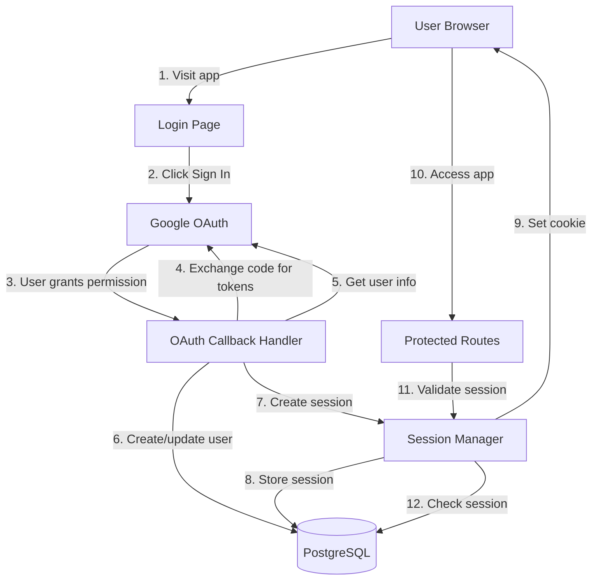

# Design Document: Google OAuth Authentication

## Overview

This design implements secure Google OAuth 2.0 authentication to replace the current manual user profile system. The implementation uses the Authorization Code Flow with PKCE for security, server-side session management for persistence, and automatic user profile creation from Google accounts. The system ensures that all routes are protected and only authenticated users can access their data.

The architecture follows TanStack Start patterns with server functions for OAuth callbacks and session management. Sessions are stored in PostgreSQL with HTTP-only cookies for security. The design includes migration paths for existing users and a development mode for testing without OAuth setup.

## Architecture

### High-Level Architecture



### Technology Stack

- **OAuth Library**: `arctic` (lightweight OAuth 2.0 library for Node.js)
- **Session Storage**: PostgreSQL with dedicated sessions table
- **Cookie Management**: Built-in Node.js cookie handling
- **Authentication Middleware**: TanStack Start server functions
- **Frontend**: React with TanStack Router for protected routes

## Components and Interfaces

### Frontend Components

#### 1. LoginPage Component
**Purpose**: Display Google sign-in button and handle authentication flow

**Location**: `src/routes/login.tsx`

**Props**: None (route component)

**State**:
```typescript
interface LoginPageState {
  isLoading: boolean
  error: string | null
}
```

**Responsibilities**:
- Display "Sign in with Google" button
- Show loading state during authentication
- Display error messages if authentication fails
- Redirect to main app after successful authentication

#### 2. AuthGuard Component
**Purpose**: Protect routes and redirect unauthenticated users

**Location**: `src/components/AuthGuard.tsx`

**Props**:
```typescript
interface AuthGuardProps {
  children: React.ReactNode
}
```

**Responsibilities**:
- Check if user is authenticated on mount
- Redirect to login page if not authenticated
- Show loading spinner while checking authentication
- Render children if authenticated

#### 3. UserMenu Component
**Purpose**: Display user info and sign out button

**Location**: `src/components/UserMenu.tsx`

**Props**:
```typescript
interface UserMenuProps {
  user: AuthenticatedUser
  onSignOut: () => void
}

interface AuthenticatedUser {
  id: number
  name: string
  email: string
  picture?: string
}
```

**Responsibilities**:
- Display user's name and profile picture
- Show dropdown menu with user info
- Provide sign out button
- Handle sign out action

### Server Functions

#### 1. initiateGoogleAuth
```typescript
const initiateGoogleAuth = createServerFn({ method: 'GET' })
  .handler(async () => {
    // Generate PKCE code verifier and challenge
    const codeVerifier = generateCodeVerifier()
    const codeChallenge = await generateCodeChallenge(codeVerifier)
    
    // Store code verifier in temporary session
    const tempSessionId = generateSessionId()
    await storeTempSession(tempSessionId, codeVerifier)
    
    // Build Google OAuth URL
    const authUrl = buildGoogleAuthUrl({
      clientId: process.env.GOOGLE_CLIENT_ID!,
      redirectUri: process.env.GOOGLE_REDIRECT_URI!,
      codeChallenge,
      state: tempSessionId,
    })
    
    // Return URL for redirect
    return { authUrl }
  })
```

#### 2. handleGoogleCallback
```typescript
const handleGoogleCallback = createServerFn({ method: 'GET' })
  .inputValidator((input: GoogleCallbackInput) => input)
  .handler(async ({ data }) => {
    const { code, state, error } = data
    
    // Handle OAuth errors
    if (error) {
      return { success: false, error: 'Authentication cancelled' }
    }
    
    // Retrieve code verifier from temp session
    const codeVerifier = await getTempSession(state)
    if (!codeVerifier) {
      return { success: false, error: 'Invalid state parameter' }
    }
    
    // Exchange code for tokens
    const tokens = await exchangeCodeForTokens({
      code,
      codeVerifier,
      clientId: process.env.GOOGLE_CLIENT_ID!,
      clientSecret: process.env.GOOGLE_CLIENT_SECRET!,
      redirectUri: process.env.GOOGLE_REDIRECT_URI!,
    })
    
    // Get user info from Google
    const googleUser = await getGoogleUserInfo(tokens.access_token)
    
    // Create or update user in database
    const user = await upsertUser({
      googleId: googleUser.sub,
      email: googleUser.email,
      name: googleUser.name,
      picture: googleUser.picture,
    })
    
    // Create session
    const session = await createSession(user.id)
    
    // Set session cookie
    setSessionCookie(session.id)
    
    // Clean up temp session
    await deleteTempSession(state)
    
    return { success: true, redirectTo: '/screenshots' }
  })

interface GoogleCallbackInput {
  code?: string
  state?: string
  error?: string
}
```

#### 3. getCurrentUser
```typescript
const getCurrentUser = createServerFn({ method: 'GET' })
  .handler(async ({ request }) => {
    // Get session ID from cookie
    const sessionId = getSessionIdFromCookie(request)
    
    if (!sessionId) {
      return { authenticated: false }
    }
    
    // Validate session
    const session = await getSession(sessionId)
    
    if (!session || session.expiresAt < new Date()) {
      // Session expired, clean up
      await deleteSession(sessionId)
      clearSessionCookie()
      return { authenticated: false }
    }
    
    // Get user info
    const user = await getUserById(session.userId)
    
    if (!user) {
      return { authenticated: false }
    }
    
    return {
      authenticated: true,
      user: {
        id: user.id,
        name: user.name,
        email: user.email,
        picture: user.picture,
      }
    }
  })
```

#### 4. signOut
```typescript
const signOut = createServerFn({ method: 'POST' })
  .handler(async ({ request }) => {
    // Get session ID from cookie
    const sessionId = getSessionIdFromCookie(request)
    
    if (sessionId) {
      // Delete session from database
      await deleteSession(sessionId)
    }
    
    // Clear session cookie
    clearSessionCookie()
    
    return { success: true }
  })
```

### Utility Functions

```typescript
// src/utils/oauth.ts

export function generateCodeVerifier(): string {
  // Generate random 128-character string
  return base64UrlEncode(crypto.randomBytes(96))
}

export async function generateCodeChallenge(verifier: string): Promise<string> {
  // SHA-256 hash of verifier
  const hash = crypto.createHash('sha256').update(verifier).digest()
  return base64UrlEncode(hash)
}

export function buildGoogleAuthUrl(params: {
  clientId: string
  redirectUri: string
  codeChallenge: string
  state: string
}): string {
  const url = new URL('https://accounts.google.com/o/oauth2/v2/auth')
  url.searchParams.set('client_id', params.clientId)
  url.searchParams.set('redirect_uri', params.redirectUri)
  url.searchParams.set('response_type', 'code')
  url.searchParams.set('scope', 'openid email profile')
  url.searchParams.set('code_challenge', params.codeChallenge)
  url.searchParams.set('code_challenge_method', 'S256')
  url.searchParams.set('state', params.state)
  url.searchParams.set('access_type', 'offline')
  url.searchParams.set('prompt', 'consent')
  return url.toString()
}

export async function exchangeCodeForTokens(params: {
  code: string
  codeVerifier: string
  clientId: string
  clientSecret: string
  redirectUri: string
}): Promise<GoogleTokens> {
  const response = await fetch('https://oauth2.googleapis.com/token', {
    method: 'POST',
    headers: { 'Content-Type': 'application/x-www-form-urlencoded' },
    body: new URLSearchParams({
      code: params.code,
      client_id: params.clientId,
      client_secret: params.clientSecret,
      redirect_uri: params.redirectUri,
      grant_type: 'authorization_code',
      code_verifier: params.codeVerifier,
    }),
  })
  
  if (!response.ok) {
    throw new Error('Failed to exchange code for tokens')
  }
  
  return await response.json()
}

export async function getGoogleUserInfo(accessToken: string): Promise<GoogleUser> {
  const response = await fetch('https://www.googleapis.com/oauth2/v3/userinfo', {
    headers: { Authorization: `Bearer ${accessToken}` },
  })
  
  if (!response.ok) {
    throw new Error('Failed to get user info')
  }
  
  return await response.json()
}

interface GoogleTokens {
  access_token: string
  refresh_token?: string
  expires_in: number
  token_type: string
}

interface GoogleUser {
  sub: string // Google user ID
  email: string
  name: string
  picture?: string
  email_verified: boolean
}
```

```typescript
// src/utils/session.ts

export function generateSessionId(): string {
  return crypto.randomBytes(32).toString('hex')
}

export function setSessionCookie(sessionId: string): void {
  // Set HTTP-only, secure cookie
  const cookie = serialize('session_id', sessionId, {
    httpOnly: true,
    secure: process.env.NODE_ENV === 'production',
    sameSite: 'lax',
    maxAge: 30 * 24 * 60 * 60, // 30 days
    path: '/',
  })
  
  // Set cookie in response header
  // (Implementation depends on framework)
}

export function getSessionIdFromCookie(request: Request): string | null {
  const cookies = parse(request.headers.get('cookie') || '')
  return cookies.session_id || null
}

export function clearSessionCookie(): void {
  const cookie = serialize('session_id', '', {
    httpOnly: true,
    secure: process.env.NODE_ENV === 'production',
    sameSite: 'lax',
    maxAge: 0,
    path: '/',
  })
  
  // Set cookie in response header
}
```

## Data Models

### Database Schema

```typescript
// src/db/schema.ts

// Update existing users table
export const users = pgTable('users', {
  id: serial('id').primaryKey(),
  email: text('email').notNull().unique(),
  name: text('name'),
  googleId: text('google_id').unique(), // NEW: Google user ID
  picture: text('picture'), // NEW: Profile picture URL
  createdAt: timestamp('created_at').defaultNow().notNull(),
  updatedAt: timestamp('updated_at').defaultNow().notNull(), // NEW
}, (table) => ({
  googleIdIdx: index('users_google_id_idx').on(table.googleId),
}))

// New sessions table
export const sessions = pgTable('sessions', {
  id: text('id').primaryKey(), // Session ID (random hex string)
  userId: integer('user_id').notNull().references(() => users.id, { onDelete: 'cascade' }),
  expiresAt: timestamp('expires_at').notNull(),
  createdAt: timestamp('created_at').defaultNow().notNull(),
}, (table) => ({
  userIdIdx: index('sessions_user_id_idx').on(table.userId),
  expiresAtIdx: index('sessions_expires_at_idx').on(table.expiresAt),
}))

// Temporary sessions for OAuth flow (stores code verifier)
export const tempSessions = pgTable('temp_sessions', {
  id: text('id').primaryKey(),
  codeVerifier: text('code_verifier').notNull(),
  expiresAt: timestamp('expires_at').notNull(),
  createdAt: timestamp('created_at').defaultNow().notNull(),
}, (table) => ({
  expiresAtIdx: index('temp_sessions_expires_at_idx').on(table.expiresAt),
}))
```

### TypeScript Types

```typescript
// src/types/auth.ts

export interface Session {
  id: string
  userId: number
  expiresAt: Date
  createdAt: Date
}

export interface AuthenticatedUser {
  id: number
  name: string
  email: string
  picture?: string
}

export interface GoogleOAuthConfig {
  clientId: string
  clientSecret: string
  redirectUri: string
}
```

## Correctness Properties

*A property is a characteristic or behavior that should hold true across all valid executions of a system—essentially, a formal statement about what the system should do. Properties serve as the bridge between human-readable specifications and machine-verifiable correctness guarantees.*

### Property 1: Session uniqueness
*For any* session ID, there should be at most one active session record in the database.
**Validates: Requirements 12.2**

### Property 2: Session expiration enforcement
*For any* session validation, if the session's expiresAt timestamp is in the past, the session should be considered invalid and deleted.
**Validates: Requirements 2.5**

### Property 3: Cookie security flags
*For any* session cookie set by the system, it should have HttpOnly, Secure (in production), and SameSite flags enabled.
**Validates: Requirements 7.1, 7.2, 7.3**

### Property 4: User-session association
*For any* valid session, there should exist exactly one user record associated with that session's userId.
**Validates: Requirements 2.3**

### Property 5: Google ID uniqueness
*For any* user record with a Google ID, that Google ID should be unique across all users in the database.
**Validates: Requirements 3.3**

### Property 6: Authentication requirement
*For any* protected route access attempt, if no valid session exists, the user should be redirected to the login page.
**Validates: Requirements 4.1**

### Property 7: Sign out cleanup
*For any* sign out operation, both the session record in the database and the session cookie should be removed.
**Validates: Requirements 5.1, 5.2**

### Property 8: OAuth state validation
*For any* OAuth callback, the state parameter should match a valid temporary session, and that temporary session should be deleted after use.
**Validates: Requirements 1.3**

### Property 9: User profile auto-update
*For any* returning user authentication, if the user's name in Google differs from the stored name, the stored name should be updated.
**Validates: Requirements 3.2**

### Property 10: Session cookie persistence
*For any* successful authentication, a session cookie should be set with a maxAge of 30 days.
**Validates: Requirements 2.4**

## Error Handling

### Error Categories

#### 1. OAuth Errors
**Trigger**: User denies permission, invalid OAuth configuration, network errors
**Handling**:
- Display user-friendly error message on login page
- Log detailed error for debugging
- Provide "Try Again" button
- Don't expose OAuth implementation details to user

#### 2. Session Errors
**Trigger**: Expired session, invalid session ID, session not found
**Handling**:
- Clear session cookie
- Redirect to login page
- Show "Session expired" message if session was valid but expired
- Don't show error if session never existed (first visit)

#### 3. Database Errors
**Trigger**: Connection failure, query timeout, constraint violations
**Handling**:
- Log error with full details
- Show generic "Something went wrong" message to user
- Provide retry mechanism
- Don't expose database structure to user

#### 4. Configuration Errors
**Trigger**: Missing environment variables, invalid OAuth credentials
**Handling**:
- Log error on server startup
- Show "Authentication not configured" on login page
- Prevent application from starting if critical config missing
- Provide clear error messages for developers

## Implementation Notes

### OAuth Flow Sequence

1. User clicks "Sign in with Google"
2. Frontend calls `initiateGoogleAuth` server function
3. Server generates PKCE code verifier and challenge
4. Server stores code verifier in temporary session
5. Server returns Google OAuth URL
6. Frontend redirects to Google OAuth URL
7. User grants permission on Google
8. Google redirects to callback URL with authorization code
9. Callback handler retrieves code verifier from temp session
10. Callback handler exchanges code for tokens using PKCE
11. Callback handler gets user info from Google
12. Callback handler creates/updates user in database
13. Callback handler creates session
14. Callback handler sets session cookie
15. Callback handler redirects to main app

### Session Management

- Sessions stored in PostgreSQL for persistence
- Session IDs are cryptographically secure random strings
- Sessions expire after 30 days of inactivity
- Expired sessions cleaned up by periodic job
- Session validation happens on every protected route access
- Session cookies are HTTP-only to prevent XSS attacks

### Migration Strategy

1. Add new columns to users table (google_id, picture, updated_at)
2. Create sessions and temp_sessions tables
3. Deploy authentication system alongside existing user selector
4. Allow users to link Google accounts to existing profiles by email
5. After migration period, remove manual user creation UI
6. Keep existing user IDs to preserve screenshot associations

### Development Mode

```typescript
// .env.local
DEV_MODE=true
DEV_USER_ID=1
```

When `DEV_MODE=true`:
- Skip OAuth and session validation
- Use `DEV_USER_ID` as authenticated user
- Show warning banner in UI
- Log warning on server startup

### Security Considerations

1. **PKCE**: Prevents authorization code interception attacks
2. **HTTP-Only Cookies**: Prevents XSS attacks from stealing session IDs
3. **Secure Flag**: Ensures cookies only sent over HTTPS in production
4. **SameSite**: Prevents CSRF attacks
5. **Session Expiration**: Limits window for session hijacking
6. **No Token Storage**: Don't store Google access tokens in database
7. **State Parameter**: Prevents CSRF during OAuth flow

### Environment Variables

```env
# Google OAuth Configuration
GOOGLE_CLIENT_ID=your-client-id.apps.googleusercontent.com
GOOGLE_CLIENT_SECRET=your-client-secret
GOOGLE_REDIRECT_URI=http://localhost:3000/auth/callback

# Session Configuration
SESSION_SECRET=random-secret-key-for-signing-cookies

# Development Mode (optional)
DEV_MODE=false
DEV_USER_ID=1
```

### Testing Strategy

**Unit Tests**:
- Test PKCE code generation and validation
- Test session ID generation
- Test cookie serialization/parsing
- Test OAuth URL building

**Integration Tests**:
- Test complete OAuth flow with mock Google responses
- Test session creation and validation
- Test protected route access with/without valid session
- Test sign out flow

**Property-Based Tests**:
- Test session uniqueness across random session IDs
- Test session expiration with random timestamps
- Test cookie security flags across different environments
- Test user-session associations with random user IDs

## Future Enhancements

1. **Refresh Token Support**: Automatically refresh expired Google tokens
2. **Remember Me**: Optional longer session duration
3. **Multi-Device Sessions**: Show active sessions and allow remote sign out
4. **OAuth Providers**: Support additional providers (GitHub, Microsoft)
5. **Two-Factor Authentication**: Add optional 2FA layer
6. **Session Activity Tracking**: Log IP addresses and user agents
7. **Suspicious Activity Detection**: Alert on unusual login patterns
8. **Account Linking**: Allow linking multiple OAuth providers to one account
