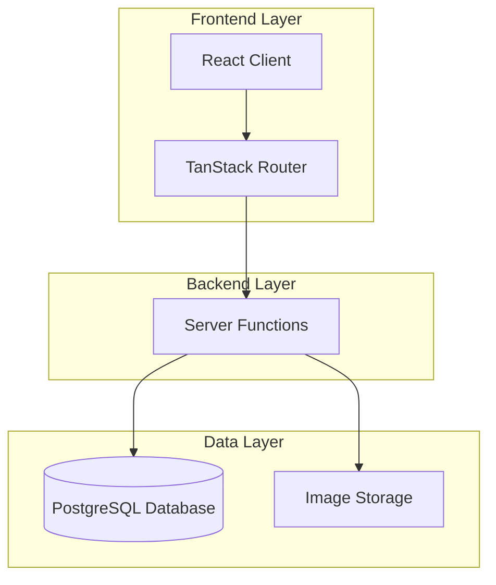

# Design Document

## Overview

The Receipts Tracker is a full-stack web application built with TanStack Start, React 19, and PostgreSQL. The application provides a file explorer-like interface for managing screenshots and receipts with automatic date-based organization. The architecture follows a modern SSR-capable pattern with server functions for backend operations, Drizzle ORM for type-safe database access, and Tailwind CSS for responsive styling.

The system is designed to handle multiple users with isolated data storage, support efficient image upload and retrieval, and provide an intuitive interface for organizing screenshots by date. Key technical considerations include image storage optimization, metadata extraction, keyboard shortcuts, and graceful error handling.

## Architecture

### High-Level Architecture



### Technology Stack

- **Frontend**: React 19, TanStack Router, TanStack Start
- **Backend**: TanStack Start Server Functions
- **Database**: PostgreSQL with Drizzle ORM
- **Styling**: Tailwind CSS v4
- **Build Tool**: Vite
- **Deployment**: Cloudflare Workers
- **Testing**: Vitest with @testing-library/react

### Architectural Patterns

1. **File-based Routing**: Routes defined in `src/routes/` with automatic route tree generation
2. **Server Functions**: Backend logic encapsulated in type-safe server functions using `createServerFn`
3. **SSR Support**: Server-side rendering for initial page loads with client-side hydration
4. **Type Safety**: End-to-end TypeScript with strict mode enabled
5. **Component-based UI**: Reusable React components with composition patterns

## Components and Interfaces

### Frontend Components

#### 1. FileExplorer Component
**Purpose**: Main interface for browsing folders and screenshots

**Props**:
```typescript
interface FileExplorerProps {
  userId: string
  currentPath?: string
}
```

**Responsibilities**:
- Display date-based folders in descending chronological order
- Show screenshot thumbnails within folders
- Handle navigation between folders
- Support keyboard shortcuts (F2 for rename, Delete for delete)
- Manage selection state for single and multiple screenshots

#### 2. ScreenshotUpload Component
**Purpose**: Handle file upload with drag-and-drop and file picker

**Props**:
```typescript
interface ScreenshotUploadProps {
  userId: string
  onUploadComplete: (screenshots: Screenshot[]) => void
}
```

**Responsibilities**:
- Accept PNG, JPG, JPEG files
- Show upload progress
- Auto-generate filenames with DDMMYY - HHMM format
- Handle multiple file uploads concurrently
- Display error messages for failed uploads

#### 3. ScreenshotCard Component
**Purpose**: Display individual screenshot with thumbnail and metadata

**Props**:
```typescript
interface ScreenshotCardProps {
  screenshot: Screenshot
  isSelected: boolean
  onSelect: (id: string) => void
  onRename: (id: string, newName: string) => void
  onDelete: (id: string) => void
  onView: (id: string) => void
}
```

**Responsibilities**:
- Render optimized thumbnail
- Show filename, date, and notes indicator
- Handle click, double-click, and keyboard events
- Support inline rename mode
- Display selection state

#### 4. ScreenshotViewer Component
**Purpose**: Full-screen view of screenshot with details and notes

**Props**:
```typescript
interface ScreenshotViewerProps {
  screenshot: Screenshot
  onClose: () => void
  onUpdateNotes: (id: string, notes: string) => void
  onDownload: (id: string) => void
}
```

**Responsibilities**:
- Display full-resolution image
- Show and edit notes
- Provide download functionality (image + notes.txt)
- Navigate to previous/next screenshot
- Close on ESC key

#### 5. SearchBar Component
**Purpose**: Filter screenshots by name

**Props**:
```typescript
interface SearchBarProps {
  onSearch: (query: string) => void
  placeholder?: string
}
```

**Responsibilities**:
- Debounce search input
- Clear search functionality
- Show search results count

#### 6. ConfirmDialog Component
**Purpose**: Reusable confirmation dialog for destructive actions

**Props**:
```typescript
interface ConfirmDialogProps {
  isOpen: boolean
  title: string
  message: string
  confirmText?: string
  cancelText?: string
  onConfirm: () => void
  onCancel: () => void
}
```

#### 7. ErrorBoundary Component
**Purpose**: Catch and display React errors gracefully

**Responsibilities**:
- Catch component errors
- Display user-friendly error message
- Provide retry functionality
- Log errors for debugging

### Server Functions

#### 1. uploadScreenshot
```typescript
const uploadScreenshot = createServerFn({ method: 'POST' })
  .validator((data: UploadScreenshotInput) => data)
  .handler(async ({ data, context }) => {
    // Validate user authentication
    // Generate filename if not provided
    // Store image data
    // Extract metadata
    // Create database record
    // Return screenshot object
  })
```

#### 2. getScreenshots
```typescript
const getScreenshots = createServerFn({ method: 'GET' })
  .validator((params: GetScreenshotsInput) => params)
  .handler(async ({ data, context }) => {
    // Validate user authentication
    // Use raw PostgreSQL client for reliable query execution
    // Build dynamic SQL query based on filters (folderDate, searchQuery)
    // Return screenshots with metadata ordered by upload date
  })
```

#### 3. renameScreenshot
```typescript
const renameScreenshot = createServerFn({ method: 'POST' })
  .validator((data: RenameScreenshotInput) => data)
  .handler(async ({ data, context }) => {
    // Validate user authentication and ownership
    // Update screenshot name
    // Preserve timestamp metadata
    // Return updated screenshot
  })
```

#### 4. deleteScreenshot
```typescript
const deleteScreenshot = createServerFn({ method: 'POST' })
  .validator((data: DeleteScreenshotInput) => data)
  .handler(async ({ data, context }) => {
    // Validate user authentication and ownership
    // Delete image data from storage
    // Delete database record
    // Return success status
  })
```

#### 5. updateScreenshotNotes
```typescript
const updateScreenshotNotes = createServerFn({ method: 'POST' })
  .validator((data: UpdateNotesInput) => data)
  .handler(async ({ data, context }) => {
    // Validate user authentication and ownership
    // Update notes in database using raw PostgreSQL client
    // Return updated screenshot
  })
```

#### 6. downloadScreenshotWithNotes
```typescript
const downloadScreenshotWithNotes = createServerFn({ method: 'GET' })
  .validator((params: DownloadInput) => params)
  .handler(async ({ data, context }) => {
    // Validate user authentication and ownership
    // Retrieve screenshot and notes
    // Generate notes.txt file
    // Return zip file with image and notes
  })
```

#### 7. batchDeleteScreenshots
```typescript
const batchDeleteScreenshots = createServerFn({ method: 'POST' })
  .validator((data: BatchDeleteInput) => data)
  .handler(async ({ data, context }) => {
    // Validate user authentication and ownership
    // Delete multiple screenshots
    // Return count of deleted items
  })
```

## Data Models

### Database Schema

```typescript
// src/db/schema.ts

export const users = pgTable('users', {
  id: serial('id').primaryKey(),
  email: text('email').notNull().unique(),
  name: text('name'),
  createdAt: timestamp('created_at').defaultNow().notNull(),
})

export const screenshots = pgTable('screenshots', {
  id: serial('id').primaryKey(),
  userId: integer('user_id').notNull().references(() => users.id, { onDelete: 'cascade' }),
  filename: text('filename').notNull(),
  originalFilename: text('original_filename').notNull(),
  imageData: text('image_data').notNull(), // Base64 encoded or storage URL
  mimeType: text('mime_type').notNull(),
  fileSize: integer('file_size').notNull(),
  captureDate: timestamp('capture_date'), // Extracted from filename or EXIF
  uploadDate: timestamp('upload_date').defaultNow().notNull(),
  notes: text('notes'),
  folderDate: text('folder_date').notNull(), // DDMMYY format for grouping
  createdAt: timestamp('created_at').defaultNow().notNull(),
  updatedAt: timestamp('updated_at').defaultNow().notNull(),
})

// Indexes for performance
export const screenshotsUserIdIdx = index('screenshots_user_id_idx').on(screenshots.userId)
export const screenshotsFolderDateIdx = index('screenshots_folder_date_idx').on(screenshots.folderDate)
export const screenshotsUploadDateIdx = index('screenshots_upload_date_idx').on(screenshots.uploadDate)
```

### TypeScript Types

```typescript
// src/types/screenshot.ts

export interface Screenshot {
  id: number
  userId: number
  filename: string
  originalFilename: string
  imageData: string
  mimeType: string
  fileSize: number
  captureDate: Date | null
  uploadDate: Date
  notes: string | null
  folderDate: string
  createdAt: Date
  updatedAt: Date
}

export interface Folder {
  date: string // DDMMYY format
  displayDate: string // Formatted for display
  screenshotCount: number
  screenshots: Screenshot[]
}

export interface UploadScreenshotInput {
  file: File
  userId: number
  customFilename?: string
}

export interface RenameScreenshotInput {
  id: number
  userId: number
  newFilename: string
}

export interface DeleteScreenshotInput {
  id: number
  userId: number
}

export interface UpdateNotesInput {
  id: number
  userId: number
  notes: string
}

export interface GetScreenshotsInput {
  userId: number
  folderDate?: string
  searchQuery?: string
}

export interface BatchDeleteInput {
  ids: number[]
  userId: number
}
```

### Utility Functions

```typescript
// src/utils/filename.ts

export interface ParsedFilename {
  date: string // DDMMYY
  time: string // HHMM
  name: string
  isValid: boolean
}

export function parseFilename(filename: string): ParsedFilename {
  // Parse "DDMMYY - HHMM - screenshot name.png" format
  // Return parsed components or indicate invalid format
  // Validates date (DD: 1-31, MM: 1-12) and time (HH: 0-23, MM: 0-59)
}

export function generateFilename(): string {
  // Generate "DDMMYY - HHMM - screenshot.png" using current timestamp
  // Always uses "screenshot" as the name (no custom name parameter)
}

export function generateUniqueFilename(
  baseFilename: string,
  existingFilenames: string[]
): string {
  // Generate unique filename by checking for duplicates
  // If baseFilename exists, appends incrementing counter: screenshot_2.png, screenshot_3.png, etc.
  // Returns baseFilename if no duplicate exists
}

export function formatFolderDate(ddmmyy: string): string {
  // Format DDMMYY for display with separators
  // e.g., "271124" -> "27/11/24"
}

export function extractFolderDate(filename: string): string {
  // Extract DDMMYY from filename or use current date
  // Falls back to current date if filename doesn't follow standard format
}
```

```typescript
// src/utils/image.ts

export async function generateThumbnail(
  imageData: string,
  maxWidth: number = 300,
  maxHeight: number = 300
): Promise<string> {
  // Generate optimized thumbnail from full image
  // Return base64 encoded thumbnail
}

export function validateImageFile(file: File): boolean {
  // Validate file type (PNG, JPG, JPEG)
  // Validate file size (e.g., max 10MB)
}

export async function extractExifData(file: File): Promise<ExifData | null> {
  // Extract EXIF metadata if available
  // Return capture date and other relevant data
}
```


## Correctness Properties

*A property is a characteristic or behavior that should hold true across all valid executions of a system—essentially, a formal statement about what the system should do. Properties serve as the bridge between human-readable specifications and machine-verifiable correctness guarantees.*

### Property 1: File type validation
*For any* file upload attempt, the system should accept only files with PNG, JPG, or JPEG mime types and reject all other file types.
**Validates: Requirements 1.1**

### Property 2: Upload persistence
*For any* screenshot uploaded by a user, querying the database immediately after upload should return a screenshot record with matching image data.
**Validates: Requirements 1.2**

### Property 3: Automatic filename generation
*For any* uploaded file without a filename matching the "DDMMYY - HHMM - name.png" format, the system should automatically generate a filename using the current timestamp in the correct format.
**Validates: Requirements 1.3**

### Property 4: Filename parsing accuracy
*For any* filename following the "DDMMYY - HHMM - name.png" format, the parsed date and time components should match the values encoded in the filename.
**Validates: Requirements 1.4**

### Property 5: User isolation
*For any* user, all screenshot operations (upload, view, rename, delete) should only affect screenshots associated with that user's profile, and queries should only return that user's screenshots.
**Validates: Requirements 1.5, 2.1, 7.2, 7.3**

### Property 6: Thumbnail and metadata display
*For any* screenshot displayed in the file explorer, the rendered output should contain a thumbnail image, the filename, and the timestamp.
**Validates: Requirements 2.2**

### Property 7: Screenshot details completeness
*For any* screenshot in detail view, the display should include the screenshot name, upload date, and file size.
**Validates: Requirements 2.4**

### Property 8: Rename persistence
*For any* screenshot, after renaming it to a new name and querying the database, the returned screenshot should have the new name.
**Validates: Requirements 3.3**

### Property 9: Timestamp preservation on rename
*For any* screenshot, renaming should not modify the captureDate, uploadDate, or createdAt timestamp fields.
**Validates: Requirements 3.4**

### Property 10: Rename cancellation idempotence
*For any* screenshot, canceling a rename operation should result in the screenshot having the same name as before the rename was initiated.
**Validates: Requirements 3.5**

### Property 11: UI consistency after rename
*For any* screenshot, after a successful rename, the filename displayed in the file explorer should match the filename stored in the database.
**Validates: Requirements 3.6**

### Property 12: Complete deletion
*For any* screenshot, after deletion is confirmed, the screenshot should not exist in the database, and all associated data (image data, metadata, notes) should be removed.
**Validates: Requirements 4.2, 4.3, 4.4**

### Property 13: UI consistency after deletion
*For any* screenshot, after successful deletion, the screenshot should not appear in the file explorer view.
**Validates: Requirements 4.5**

### Property 14: Date-based folder grouping
*For any* set of screenshots, when displayed in the file explorer, screenshots with the same DDMMYY date should be grouped into the same folder.
**Validates: Requirements 5.1**

### Property 15: Automatic folder assignment
*For any* screenshot uploaded with a DDMMYY prefix in the filename, the system should assign it to the folder corresponding to that date in DDMMYY format.
**Validates: Requirements 5.2, 6.2**

### Property 16: Folder content filtering
*For any* date folder, clicking on it should display only screenshots that belong to that specific date.
**Validates: Requirements 5.3, 8.2**

### Property 17: Empty folder exclusion
*For any* date that has no associated screenshots, that date should not appear as a folder in the file explorer.
**Validates: Requirements 5.4**

### Property 18: Folder chronological sorting
*For any* set of date folders displayed in the file explorer, they should be sorted in descending chronological order with the most recent date first.
**Validates: Requirements 5.5**

### Property 19: Date extraction from filename
*For any* filename containing a DDMMYY prefix, the system should correctly extract the day, month, and year components.
**Validates: Requirements 6.1**

### Property 20: Consistent folder assignment for same date
*For any* set of screenshots uploaded with the same DDMMYY date prefix, all screenshots should be placed in the same folder.
**Validates: Requirements 6.4**

### Property 21: Complete datetime extraction
*For any* filename following the complete "DDMMYY - HHMM - name.png" format, the system should extract both the date and time components and store them as metadata.
**Validates: Requirements 6.5**

### Property 22: Authorization enforcement
*For any* screenshot operation (rename, delete, update notes) attempted by a user, if the screenshot does not belong to that user, the operation should be rejected.
**Validates: Requirements 7.4**

### Property 23: URL synchronization with navigation
*For any* folder navigation action, the browser URL should update to reflect the current folder path.
**Validates: Requirements 8.4**

### Property 24: Browser history integration
*For any* navigation state in the browser history, using back or forward buttons should navigate to the corresponding folder view.
**Validates: Requirements 8.5**

### Property 25: Upload timestamp recording
*For any* screenshot uploaded, the uploadDate field should be set to a timestamp within a few seconds of the upload time.
**Validates: Requirements 9.1**

### Property 26: Metadata display completeness
*For any* screenshot with both upload time and capture time, the detail view should display both timestamps.
**Validates: Requirements 9.3**

### Property 27: Modification timestamp on rename
*For any* screenshot, after renaming, the updatedAt timestamp should be more recent than before the rename.
**Validates: Requirements 9.4**

### Property 28: Multi-criteria sorting
*For any* set of screenshots, the system should support sorting by upload date, capture date, or name, and the results should be correctly ordered according to the chosen criterion.
**Validates: Requirements 9.5**

### Property 29: Batch move consistency
*For any* set of selected screenshots, after a batch move operation to a target folder, all screenshots should belong to that folder.
**Validates: Requirements 10.3**

### Property 30: Batch delete completeness
*For any* set of selected screenshots, after a batch delete operation, none of the screenshots should exist in the database.
**Validates: Requirements 10.4**

### Property 31: Batch operation count accuracy
*For any* batch operation, the confirmation message should display a count that matches the number of screenshots actually affected.
**Validates: Requirements 10.5**

### Property 32: Search filtering accuracy
*For any* search query, all returned screenshots should have filenames that contain the search query as a substring (case-insensitive).
**Validates: Requirements 11.1**

### Property 33: Cross-folder search
*For any* search query, the results should include matching screenshots from all folders, not just the currently viewed folder.
**Validates: Requirements 11.2**

### Property 34: Search result folder indication
*For any* screenshot in search results, the display should indicate which folder (date) the screenshot belongs to.
**Validates: Requirements 11.4**

### Property 35: Notes persistence
*For any* screenshot, after adding or updating notes and querying the database, the returned screenshot should have the updated notes text.
**Validates: Requirements 14.2**

### Property 36: Notes export round-trip
*For any* screenshot with notes, downloading the screenshot should create a text file named "DDMMYY - HHMM - screenshot_note.txt" containing the exact notes text from the database.
**Validates: Requirements 14.3, 14.4**

### Property 37: Notes indicator display
*For any* screenshot with non-empty notes, the file explorer should display a visual indicator showing that notes exist.
**Validates: Requirements 14.5**

### Property 38: Form data preservation on failure
*For any* form submission that fails, the form fields should retain the user's input data for resubmission.
**Validates: Requirements 16.3**

### Property 39: Input validation before processing
*For any* form submission with invalid data, the system should reject the submission before processing and return validation errors.
**Validates: Requirements 16.4**

### Property 40: Field-specific error display
*For any* form validation failure, each invalid field should be highlighted with a specific error message indicating the validation issue.
**Validates: Requirements 16.5**


## Error Handling

### Error Categories

#### 1. Validation Errors
**Trigger**: Invalid user input (wrong file type, empty fields, invalid dates)
**Handling**:
- Validate on client-side before submission
- Display field-specific error messages
- Preserve user input for correction
- Use red borders and error text below fields

#### 2. Network Errors
**Trigger**: Failed HTTP requests, timeout, connection loss
**Handling**:
- Display toast notification with retry option
- Implement exponential backoff for retries
- Show loading states during operations
- Cache operations for offline resilience

#### 3. Database Errors
**Trigger**: Query failures, constraint violations, connection issues
**Handling**:
- Log detailed error on server
- Return user-friendly message to client
- Implement automatic retry (up to 3 attempts)
- Display generic error message without exposing internals

#### 4. File Processing Errors
**Trigger**: Corrupt images, unsupported formats, file size exceeded
**Handling**:
- Validate file before upload
- Show specific error for each failure type
- Provide guidance on acceptable formats/sizes
- Allow user to select different file

#### 5. Authorization Errors
**Trigger**: User attempts to access/modify another user's screenshots
**Handling**:
- Return 403 Forbidden status
- Redirect to login if session expired
- Display "Access Denied" message
- Log security event for monitoring

### Error Handling Patterns

```typescript
// Server function error handling
const uploadScreenshot = createServerFn({ method: 'POST' })
  .validator((data: UploadScreenshotInput) => {
    if (!data.file) throw new Error('File is required')
    if (!validateImageFile(data.file)) {
      throw new Error('Invalid file type. Please upload PNG, JPG, or JPEG')
    }
    return data
  })
  .handler(async ({ data, context }) => {
    try {
      // Attempt upload
      const screenshot = await db.insert(screenshots).values(...)
      return { success: true, screenshot }
    } catch (error) {
      console.error('Upload failed:', error)
      throw new Error('Failed to upload screenshot. Please try again.')
    }
  })
```

```typescript
// Client-side error handling
function ScreenshotUpload() {
  const [error, setError] = useState<string | null>(null)
  
  const handleUpload = async (file: File) => {
    try {
      setError(null)
      const result = await uploadScreenshot({ file, userId })
      // Success handling
    } catch (err) {
      setError(err.message || 'An unexpected error occurred')
      // Show error toast
    }
  }
  
  return (
    <div>
      {error && (
        <div className="bg-red-100 border border-red-400 text-red-700 px-4 py-3 rounded">
          {error}
        </div>
      )}
      {/* Upload UI */}
    </div>
  )
}
```

### Error Recovery Strategies

1. **Retry with Exponential Backoff**: For transient network/database errors
2. **Graceful Degradation**: Show cached data when real-time data unavailable
3. **User Guidance**: Provide clear instructions on how to resolve errors
4. **State Preservation**: Keep user input when operations fail
5. **Logging**: Record errors for debugging and monitoring

## Testing Strategy

### Unit Testing

Unit tests will verify specific examples, edge cases, and component behavior using Vitest and @testing-library/react.

**Test Coverage**:
- Utility functions (filename parsing, date formatting, image validation)
- Component rendering and user interactions
- Server function validation logic
- Error handling paths
- Edge cases (empty inputs, invalid dates, special characters)

**Example Unit Tests**:
```typescript
// src/utils/filename.test.ts
describe('parseFilename', () => {
  it('should parse valid filename format', () => {
    const result = parseFilename('271124 - 1430 - receipt.png')
    expect(result).toEqual({
      date: '271124',
      time: '1430',
      name: 'receipt',
      isValid: true
    })
  })
  
  it('should handle invalid format', () => {
    const result = parseFilename('invalid-filename.png')
    expect(result.isValid).toBe(false)
  })
})

// src/components/ScreenshotCard.test.tsx
describe('ScreenshotCard', () => {
  it('should display screenshot thumbnail and metadata', () => {
    const screenshot = createMockScreenshot()
    render(<ScreenshotCard screenshot={screenshot} />)
    
    expect(screen.getByAltText(screenshot.filename)).toBeInTheDocument()
    expect(screen.getByText(screenshot.filename)).toBeInTheDocument()
  })
  
  it('should trigger rename on F2 key press', () => {
    const onRename = vi.fn()
    render(<ScreenshotCard screenshot={mockScreenshot} onRename={onRename} />)
    
    fireEvent.keyDown(screen.getByRole('img'), { key: 'F2' })
    expect(onRename).toHaveBeenCalled()
  })
})
```

### Property-Based Testing

Property-based tests will verify universal properties that should hold across all inputs using **fast-check** (JavaScript property-based testing library).

**Configuration**:
- Minimum 100 iterations per property test
- Each property test tagged with format: `**Feature: receipts-tracker, Property {number}: {property_text}**`
- One property-based test per correctness property

**Test Generators**:
```typescript
// src/test/generators.ts
import fc from 'fast-check'

export const arbFilename = fc.record({
  date: fc.tuple(
    fc.integer({ min: 1, max: 31 }),  // day
    fc.integer({ min: 1, max: 12 }),  // month
    fc.integer({ min: 0, max: 99 })   // year
  ).map(([d, m, y]) => `${d.toString().padStart(2, '0')}${m.toString().padStart(2, '0')}${y.toString().padStart(2, '0')}`),
  time: fc.tuple(
    fc.integer({ min: 0, max: 23 }),  // hour
    fc.integer({ min: 0, max: 59 })   // minute
  ).map(([h, m]) => `${h.toString().padStart(2, '0')}${m.toString().padStart(2, '0')}`),
  name: fc.string({ minLength: 1, maxLength: 50 })
})

export const arbScreenshot = fc.record({
  id: fc.integer({ min: 1 }),
  userId: fc.integer({ min: 1 }),
  filename: arbFilename.map(f => `${f.date} - ${f.time} - ${f.name}.png`),
  imageData: fc.base64String(),
  mimeType: fc.constantFrom('image/png', 'image/jpeg'),
  fileSize: fc.integer({ min: 1000, max: 10000000 }),
  notes: fc.option(fc.string(), { nil: null })
})
```

**Example Property Tests**:
```typescript
// src/utils/filename.property.test.ts
import fc from 'fast-check'
import { parseFilename, generateFilename } from './filename'

/**
 * Feature: receipts-tracker, Property 4: Filename parsing accuracy
 */
describe('Property: Filename parsing accuracy', () => {
  it('should correctly parse any valid filename format', () => {
    fc.assert(
      fc.property(arbFilename, (filename) => {
        const fullFilename = `${filename.date} - ${filename.time} - ${filename.name}.png`
        const parsed = parseFilename(fullFilename)
        
        return parsed.isValid &&
               parsed.date === filename.date &&
               parsed.time === filename.time &&
               parsed.name === filename.name
      }),
      { numRuns: 100 }
    )
  })
})

/**
 * Feature: receipts-tracker, Property 9: Timestamp preservation on rename
 */
describe('Property: Timestamp preservation on rename', () => {
  it('should not modify timestamps when renaming', async () => {
    fc.assert(
      fc.asyncProperty(
        arbScreenshot,
        fc.string({ minLength: 1 }),
        async (screenshot, newName) => {
          // Create screenshot in test database
          const created = await createTestScreenshot(screenshot)
          
          // Rename screenshot
          const renamed = await renameScreenshot({
            id: created.id,
            userId: created.userId,
            newFilename: newName
          })
          
          // Verify timestamps unchanged
          return renamed.captureDate === created.captureDate &&
                 renamed.uploadDate === created.uploadDate &&
                 renamed.createdAt === created.createdAt
        }
      ),
      { numRuns: 100 }
    )
  })
})
```

### Integration Testing

Integration tests will verify end-to-end workflows combining multiple components and server functions.

**Test Scenarios**:
- Complete upload flow: select file → upload → verify in database → display in UI
- Rename workflow: select screenshot → press F2 → enter new name → verify update
- Delete workflow: select screenshot → confirm deletion → verify removal
- Search workflow: enter query → verify filtered results → clear search
- Notes workflow: add notes → download with notes file → verify content

### Test Data Management

```typescript
// src/test/fixtures.ts
export function createMockScreenshot(overrides?: Partial<Screenshot>): Screenshot {
  return {
    id: 1,
    userId: 1,
    filename: '271124 - 1430 - receipt.png',
    originalFilename: 'IMG_001.png',
    imageData: 'data:image/png;base64,...',
    mimeType: 'image/png',
    fileSize: 50000,
    captureDate: new Date('2024-11-27T14:30:00'),
    uploadDate: new Date('2024-11-27T14:35:00'),
    notes: null,
    folderDate: '27112024',
    createdAt: new Date('2024-11-27T14:35:00'),
    updatedAt: new Date('2024-11-27T14:35:00'),
    ...overrides
  }
}

export async function createTestScreenshot(data: Partial<Screenshot>): Promise<Screenshot> {
  // Insert into test database
  const [screenshot] = await testDb.insert(screenshots).values(data).returning()
  return screenshot
}

export async function cleanupTestData() {
  // Clean up test database after tests
  await testDb.delete(screenshots)
  await testDb.delete(users)
}
```

### Testing Best Practices

1. **Isolation**: Each test should be independent and not rely on other tests
2. **Cleanup**: Always clean up test data after tests complete
3. **Realistic Data**: Use realistic test data that matches production patterns
4. **Error Cases**: Test both success and failure paths
5. **Performance**: Keep tests fast by mocking external dependencies
6. **Coverage**: Aim for high coverage of critical paths, not 100% coverage
7. **Readability**: Write clear test names that describe what is being tested

## Implementation Notes

### Image Storage Strategy

For the initial implementation, images will be stored as base64-encoded strings in the PostgreSQL database. This simplifies deployment and avoids the need for separate object storage.

**Considerations**:
- Base64 encoding increases size by ~33%
- PostgreSQL can handle large text fields efficiently
- For production scale, consider migrating to Cloudflare R2 or similar object storage
- Store thumbnails separately to optimize loading performance

### Database Client Strategy

The application uses a hybrid approach for database operations:

**Raw PostgreSQL Client (`pg`)**: Used for all runtime operations in Cloudflare Workers environment where Drizzle ORM may have compatibility issues:
- `uploadScreenshot`: Direct INSERT with raw SQL for reliable image data storage
- `getScreenshots`: Direct SELECT with dynamic query building for filtering and search
- `updateScreenshotNotes`: Direct UPDATE with raw SQL for notes persistence
- `renameScreenshot`: Direct UPDATE with ownership validation
- `deleteScreenshot`: DELETE operations with ownership validation
- `batchDeleteScreenshots`: Multiple DELETE operations with ownership checks
- `batchMoveScreenshots`: Multiple UPDATE operations with ownership checks
- `downloadScreenshotWithNotes`: Direct SELECT with ownership validation for download operations

**Drizzle ORM**: Used exclusively for schema definition and migrations, providing type safety at the schema level without runtime compatibility issues.

This approach ensures maximum reliability in the Cloudflare Workers environment while maintaining type safety through TypeScript interfaces and schema definitions.

### Authentication

The initial implementation will use a simple user ID-based system. For production:
- Implement proper authentication (e.g., Clerk, Auth0, or custom JWT)
- Add session management
- Implement password reset and email verification
- Add OAuth providers (Google, GitHub)

### Performance Optimizations

1. **Database Indexes**: Create indexes on userId, folderDate, and uploadDate
2. **Thumbnail Generation**: Generate and cache thumbnails on upload
3. **Lazy Loading**: Implement virtual scrolling for large folders
4. **Query Optimization**: Use pagination for screenshot lists
5. **Caching**: Cache folder lists and frequently accessed screenshots
6. **Image Compression**: Compress images before storage

### Deployment Considerations

- **Environment Variables**: DATABASE_URL, SESSION_SECRET
- **Database Migrations**: Run migrations before deployment
- **Cloudflare Workers**: Configure wrangler.jsonc for deployment
- **CORS**: Configure CORS for file uploads if needed
- **Rate Limiting**: Implement rate limiting for upload endpoints
- **Monitoring**: Add error tracking and performance monitoring

### Future Enhancements

1. **Bulk Export**: Export all screenshots for a date range as ZIP
2. **Tags**: Add tagging system for better organization
3. **OCR**: Extract text from screenshots for searchability
4. **Sharing**: Share screenshots with other users or generate public links
5. **Mobile App**: Native mobile app for easier screenshot capture
6. **Cloud Sync**: Automatic upload from desktop/mobile screenshot folders
7. **AI Categorization**: Automatically categorize screenshots by content
