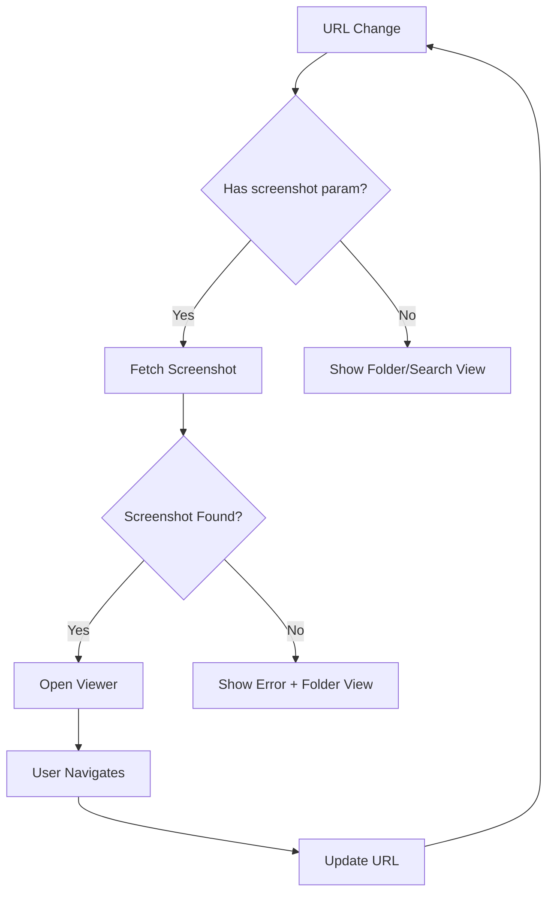

# Design Document: Screenshot Deep Linking

## Overview

This feature implements deep linking for screenshots, allowing users to access specific screenshots directly via URL. The implementation uses URL parameters to encode the application state and automatically opens the screenshot viewer when a screenshot ID is present in the URL.

## Architecture

### URL Structure

```
Base: /screenshots

Patterns:
1. Folder view:     /screenshots?folder=DDMMYY
2. Search view:     /screenshots?query=%23tag
3. Screenshot only: /screenshots?screenshot=123
4. Screenshot + folder: /screenshots?folder=DDMMYY&screenshot=123
5. Screenshot + search: /screenshots?query=%23tag&screenshot=123
```

### State Flow



## Components and Interfaces

### 1. Route Configuration (`screenshots.tsx`)

**Current**:
```typescript
validateSearch: (search: Record<string, unknown>) => {
  return {
    query: (search.query as string) || undefined,
    folder: (search.folder as string) || undefined,
  };
}
```

**Updated**:
```typescript
validateSearch: (search: Record<string, unknown>) => {
  return {
    query: (search.query as string) || undefined,
    folder: (search.folder as string) || undefined,
    screenshot: search.screenshot ? Number(search.screenshot) : undefined,
  };
}
```

### 2. FileExplorer Component

**New Props**:
```typescript
interface FileExplorerProps {
  userId: number;
  currentPath?: string;
  initialSearchQuery?: string;
  initialScreenshotId?: number;  // NEW
  onError?: (message: string) => void;
}
```

**New State**:
```typescript
const [autoOpenScreenshotId, setAutoOpenScreenshotId] = useState<number | undefined>(
  initialScreenshotId
);
```

**New Effect** (Auto-open screenshot from URL):
```typescript
useEffect(() => {
  if (autoOpenScreenshotId && screenshots.length > 0) {
    const screenshot = screenshots.find(s => s.id === autoOpenScreenshotId);
    if (screenshot) {
      setViewingScreenshot(screenshot);
      setAutoOpenScreenshotId(undefined); // Clear after opening
    } else {
      // Screenshot not found in current list
      fetchAndOpenScreenshot(autoOpenScreenshotId);
    }
  }
}, [autoOpenScreenshotId, screenshots]);
```

### 3. ScreenshotViewer Component

**URL Update on Open**:
```typescript
useEffect(() => {
  if (screenshot) {
    // Update URL when viewer opens
    const currentParams = new URLSearchParams(window.location.search);
    currentParams.set('screenshot', screenshot.id.toString());
    navigate({
      search: Object.fromEntries(currentParams),
      replace: false, // Add to history
    });
  }
}, [screenshot.id]);
```

**URL Update on Close**:
```typescript
const handleClose = () => {
  // Remove screenshot parameter from URL
  const currentParams = new URLSearchParams(window.location.search);
  currentParams.delete('screenshot');
  navigate({
    search: Object.fromEntries(currentParams),
    replace: false, // Add to history so back button works
  });
  onClose();
};
```

**URL Update on Navigation**:
```typescript
const handleNavigate = (direction: 'prev' | 'next') => {
  onNavigate?.(direction);
  
  // Update URL with new screenshot ID
  const currentIndex = allScreenshots.findIndex(s => s.id === screenshot.id);
  const newIndex = direction === 'prev' ? currentIndex - 1 : currentIndex + 1;
  const newScreenshot = allScreenshots[newIndex];
  
  if (newScreenshot) {
    const currentParams = new URLSearchParams(window.location.search);
    currentParams.set('screenshot', newScreenshot.id.toString());
    navigate({
      search: Object.fromEntries(currentParams),
      replace: true, // Replace history for navigation within viewer
    });
  }
};
```

### 4. New Server Function: `getScreenshotById`

```typescript
export const getScreenshotById = createServerFn({ method: 'GET' })
  .inputValidator((input: { id: number; userId: number }) => input)
  .handler(async ({ data }) => {
    const { id, userId } = data;
    
    const client = new Client({
      connectionString: process.env.DATABASE_URL!,
    });
    
    try {
      await client.connect();
      
      const result = await client.query(
        `SELECT id, user_id as "userId", filename, original_filename as "originalFilename",
                image_data as "imageData", mime_type as "mimeType", file_size as "fileSize",
                capture_date as "captureDate", upload_date as "uploadDate", notes,
                folder_date as "folderDate", created_at as "createdAt", updated_at as "updatedAt"
         FROM screenshots
         WHERE id = $1 AND user_id = $2`,
        [id, userId]
      );
      
      if (result.rows.length === 0) {
        return { success: false, error: 'Screenshot not found or access denied' };
      }
      
      return { success: true, screenshot: result.rows[0] };
    } finally {
      await client.end();
    }
  });
```

## Data Flow

### Opening Screenshot from URL

1. User navigates to `/screenshots?screenshot=123`
2. Route validates and parses `screenshot=123` → `{ screenshot: 123 }`
3. `ScreenshotsPage` passes `initialScreenshotId={123}` to `FileExplorer`
4. `FileExplorer` sets `autoOpenScreenshotId` state
5. Effect checks if screenshot exists in current list:
   - If yes: Open viewer immediately
   - If no: Fetch screenshot by ID, then open viewer
6. Viewer opens and displays screenshot
7. If screenshot not found: Show error toast and remain in folder view

### Navigating Between Screenshots

1. User presses arrow key or clicks next/prev button
2. `ScreenshotViewer` calls `handleNavigate('next')`
3. Parent `FileExplorer` updates `viewingScreenshot` state
4. `ScreenshotViewer` receives new screenshot prop
5. `ScreenshotViewer` updates URL with new screenshot ID
6. Browser history is updated (using `replace: true` to avoid cluttering history)

### Closing Screenshot Viewer

1. User presses ESC or clicks close button
2. `ScreenshotViewer` calls `handleClose()`
3. URL parameter `screenshot` is removed
4. `onClose()` callback is called
5. Parent closes viewer
6. Browser history is updated (using `replace: false` so back button works)

## Error Handling

### Screenshot Not Found

```typescript
if (!screenshot) {
  toast.error('Screenshot not found');
  // Remove invalid screenshot parameter
  const currentParams = new URLSearchParams(window.location.search);
  currentParams.delete('screenshot');
  navigate({
    search: Object.fromEntries(currentParams),
    replace: true,
  });
  return;
}
```

### Access Denied

```typescript
if (result.error === 'access denied') {
  toast.error('You do not have permission to view this screenshot');
  navigate({ to: '/screenshots', replace: true });
  return;
}
```

### Network Error

```typescript
catch (error) {
  toast.error('Failed to load screenshot. Please try again.');
  // Offer retry button
  setRetryCallback(() => () => fetchAndOpenScreenshot(id));
}
```

## Testing Strategy

### Unit Tests

1. URL parameter parsing
2. Screenshot ID validation
3. State synchronization logic
4. Error handling for invalid IDs

### Integration Tests

1. Opening screenshot from URL
2. Navigation updates URL correctly
3. Closing viewer removes parameter
4. Browser back/forward buttons work
5. Search context is preserved
6. Folder context is preserved

### Manual Testing Scenarios

1. Copy screenshot URL → Paste in new tab → Verify opens same screenshot
2. Navigate next/prev → Verify URL updates
3. Close viewer → Press back button → Verify viewer reopens
4. Reload page with screenshot URL → Verify restores state
5. Invalid screenshot ID → Verify error handling
6. Search + screenshot → Verify both contexts preserved

## Performance Considerations

1. **Lazy Loading**: Only fetch screenshot by ID if not in current list
2. **Caching**: Cache recently viewed screenshots to avoid refetching
3. **Preloading**: Preload adjacent screenshots for faster navigation
4. **Debouncing**: Debounce URL updates during rapid navigation
5. **History Management**: Use `replace: true` for navigation within viewer to avoid history pollution

## Security Considerations

1. **Authorization**: Always verify user owns screenshot server-side
2. **Input Validation**: Validate screenshot ID is a positive integer
3. **SQL Injection**: Use parameterized queries
4. **XSS Prevention**: Sanitize all URL parameters before use

## Backward Compatibility

- Existing URLs without `screenshot` parameter continue to work
- Folder-only URLs (`?folder=DDMMYY`) unchanged
- Search-only URLs (`?query=...`) unchanged
- No breaking changes to existing functionality

## Future Enhancements

1. **Shareable Links**: Add "Copy Link" button in viewer
2. **Thumbnail Previews**: Show thumbnail in link previews
3. **Expiring Links**: Support temporary share links
4. **Collection Links**: Link to multiple screenshots
5. **Embed Support**: Allow embedding screenshots in other pages
